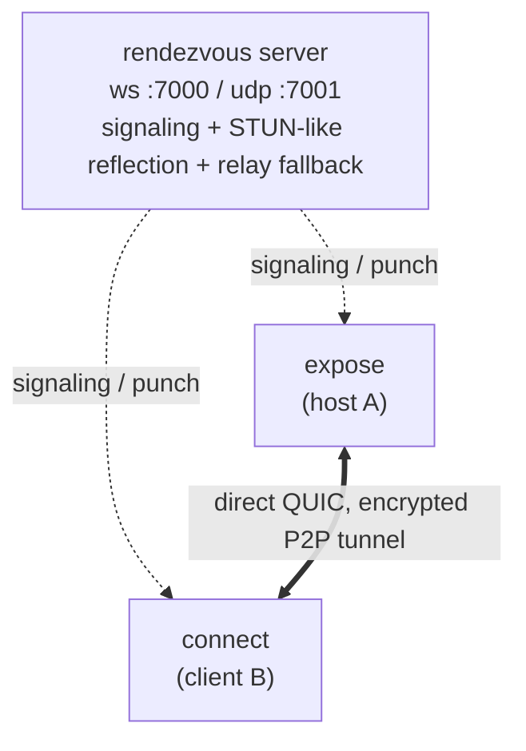

# relay-tunnel

[](https://github.com/chriswirz/relay-tunnel/actions/workflows/ci.yml)

**relay-tunnel** connects two machines directly, peer-to-peer, without manually opening any ports.
A tiny rendezvous server helps the two peers find each other and punch through their NATs.
Once connected, your traffic flows straight between the peers, so the server is not an exit node.

Think of it like `http-tunnel`, except relay-tunnel establishes a real P2P link instead of relaying every byte through the server.
The server only relays data as a last-resort fallback when a direct path is impossible, for example symmetric NAT or CGNAT on both ends.



## Features

- NAT traversal via UDP hole punching, with automatic server-relay fallback when a direct path cannot be established.
- Encrypted and authenticated transport using QUIC (TLS 1.3), with the host's ephemeral certificate fingerprint pinned through the signaling channel so a compromised relay cannot impersonate the host.
- Multiplexed, so one connection carries many concurrent streams.
- TCP port forwarding (`-L`), like SSH local forwards.
- SOCKS5 proxy (`-D`) to reach arbitrary destinations through the peer.
- File transfer (`get` and `put`), with the host's file access confined to a chosen root directory.
- Remote command execution (`exec`), opt-in on the host.
- Automatic reconnection, so a running tunnel resumes on its own after the peer, the network, or the rendezvous server goes offline and comes back.
- Single static binary for Linux, macOS, and Windows.

## Install

```sh
go install github.com/chriswirz/relay-tunnel/cmd/relay-tunnel@latest
```

Or grab a prebuilt binary from the [Releases](../../releases) page, or build locally:

```sh
make build          # produces ./relay-tunnel
```

### Releases

CI publishes releases automatically once all checks pass.
Every push to the default branch that passes CI updates a rolling release named after the branch, so `/releases/latest` is always the newest build of the current tree.
Pushing a `v*` tag publishes a versioned release with the same artifacts.
Each release carries the binaries for every platform (plus SHA-256 checksums), the `.deb`/`.rpm` packages, and the `relay-sync` example.

### Linux packages (.deb / .rpm)

Each release includes `.deb` and `.rpm` packages (amd64 and arm64), built with [nfpm](https://nfpm.goreleaser.com/) from [`packaging/nfpm.yaml`](packaging/nfpm.yaml).

```sh
sudo dpkg -i relay-tunnel_*_amd64.deb     # Debian/Ubuntu
sudo rpm -i  relay-tunnel-*.x86_64.rpm    # Fedora/RHEL/openSUSE
```

The package installs the binary to `/usr/bin/relay-tunnel` and ships a systemd unit for the rendezvous server (not auto-enabled).

```sh
sudo nano /etc/relay-tunnel/server.env          # set ports and --public-udp
sudo systemctl enable --now relay-tunnel-server
```

## Quick start

### 1. Run a rendezvous server (once, somewhere both peers can reach)

```sh
relay-tunnel server --http :7000 --udp :7001
# Behind NAT/load-balancer, advertise the reachable UDP address:
relay-tunnel server --public-udp your.host.example:7001
```

The server needs its TCP (signaling) and UDP (reflection/relay) ports reachable.
It never terminates your tunnel traffic unless relay fallback kicks in.

### Why the server has two ports, and whether it must stay up

The server listens on TCP (HTTP) and UDP because they do different jobs.

The TCP port serves the WebSocket signaling channel (`/signal`).
Peers connect to it to pair by session code and to exchange their public addresses and the host's certificate fingerprint.

The UDP port does two things.
It acts as a STUN-like reflector: each peer sends it a probe and learns its own public `ip:port` to share with the other side.
It is also the relay-fallback path: when a direct connection cannot be punched, the peers forward their (still encrypted) QUIC datagrams through this port.

Whether the server must stay up depends on how a session connected.

The server is always required at the start of a session, because pairing and reflection go through it.
Once a **direct** (hole-punched) connection is established, the tunnel is peer-to-peer and no longer touches the server, so the server can go down without dropping that live tunnel.
A **relayed** session, by contrast, carries all its traffic through the server, so the server must stay up for the whole session.

In practice, keep the server running: the `expose` host re-registers with it after each client, and the automatic reconnection described below re-pairs through it whenever a tunnel drops. A server that is only up intermittently means peers can pair only while it happens to be reachable.

### 2. On the machine you want to reach (`expose`)

```sh
relay-tunnel expose --server ws://your.host.example:7000/signal --allow-dial
```

This prints a session code.
Share it with the other side out-of-band.

### 3. On your machine (`connect`)

```sh
# Forward local :9000 to the host's 127.0.0.1:8080
relay-tunnel connect --server ws://your.host.example:7000/signal --code CODE \
  -L 9000:127.0.0.1:8080
```

Now `http://localhost:9000` on your machine hits `127.0.0.1:8080` on the host, directly and peer-to-peer.

## Usage

```
relay-tunnel server   [--http :7000] [--udp :7001] [--public-udp HOST:7001] [--public-url URL]
relay-tunnel expose   --server ws://HOST:7000/signal [--code CODE] [policy]
relay-tunnel connect  --server ws://HOST:7000/signal --code CODE [actions]
relay-tunnel version
```

`--public-url` is optional and informational: the server logs it at startup as the URL clients should use. It matters behind a reverse proxy, where the internal `--http` address is not the address clients dial.

### Session code (`--code`)

The session code is the shared secret that pairs the two peers on the rendezvous server.
Both sides must present the same code, and the server only pairs a `host` (`expose`) with a `client` (`connect`) that carry an identical code.
On `expose`, `--code CODE` sets the code explicitly, and if you omit it a random code is generated and printed for you to share.
On `connect`, `--code CODE` is required and must match the code from the `expose` side.
Share the code over a trusted channel and treat it as a secret, because anyone who has it (and can reach the server) can pair with your host, subject to the host's policy flags.

### `expose` policy flags

The host is deny-by-default.
Grant exactly what you need.

| Flag                | Effect                                                        |
|---------------------|--------------------------------------------------------------|
| `--allow-dial`      | Let the client open TCP connections through this host (`-L`, `-D`). |
| `--allow host:port` | Whitelist a single dial target (repeatable). Implies dialing. |
| `--allow-exec`      | Allow remote command execution (`exec`).                     |
| `--file-root DIR`   | Allow file `get`/`put`, confined to `DIR`.                   |

### `connect` actions

| Action                              | Description                              |
|-------------------------------------|------------------------------------------|
| `-L [laddr:]lport:rhost:rport`      | Local port forward (repeatable).         |
| `-D [laddr:]lport`                  | Local SOCKS5 proxy through the peer.      |
| `get REMOTE LOCAL`                  | Download a file from the host.           |
| `put LOCAL REMOTE`                  | Upload a file to the host.               |
| `exec -- CMD [ARGS...]`             | Run a command on the host.               |

#### Local port forward (`-L`) vs SOCKS5 proxy (`-D`)

A local port forward has a single fixed destination that you choose when you start it.
With `-L 9000:127.0.0.1:8080`, every connection to local port 9000 is sent to `127.0.0.1:8080` as seen from the host, and nothing else.
Use `-L` when you want to reach one specific service through the peer.

A SOCKS5 proxy has no fixed destination; the destination is chosen per-connection by the client application.
With `-D 1080`, any SOCKS5-aware program (a browser, `curl --socks5`, and so on) can ask the proxy for any host and port, and the host dials it on demand.
Use `-D` when you want general, on-demand access to many destinations reachable from the peer, similar to a lightweight VPN for TCP.

In short, `-L` is one preset tunnel to one address, while `-D` is a dynamic proxy that opens a new tunnel to whatever address each request names.
Both require the host to permit dialing (`--allow-dial`, or an `--allow` entry that matches the target).

### Examples

```sh
# SOCKS5 proxy: browse the host's network from your machine
relay-tunnel connect --server ws://SRV:7000/signal --code CODE -D 1080

# Multiple forwards at once
relay-tunnel connect --server ws://SRV:7000/signal --code CODE \
  -L 8000:127.0.0.1:80 -L 5432:db.internal:5432

# File transfer (host started with --file-root /srv/share)
relay-tunnel connect --server ws://SRV:7000/signal --code CODE get report.pdf ./report.pdf
relay-tunnel connect --server ws://SRV:7000/signal --code CODE put ./patch.tar.gz incoming/patch.tar.gz

# Remote command (host started with --allow-exec)
relay-tunnel connect --server ws://SRV:7000/signal --code CODE exec -- uname -a
```

## Configuration file

Every subcommand can read its settings from a JSON config file, which is handy for keeping the session code and server URL nearby across re-runs.
Command-line flags always take priority, so a value in the file is used only when the matching flag is not given.
By default the tool looks for `config.json` in the current directory, and `--config PATH` points it at another file.
A missing default `config.json` is ignored, but a file named explicitly with `--config` must exist.

Print a fully populated sample to stdout and save it as a starting point.

```sh
relay-tunnel --example-config > config.json
```

The file has one section per subcommand: `server`, `expose`, and `connect`.
Each section mirrors that subcommand's flags, and each subcommand reads only its own section.
Empty or omitted fields never override a flag or a built-in default.

```json
{
  "server": {
    "enabled": false,
    "http": ":7000",
    "udp": ":7001",
    "public_udp": "your.host.example:7001",
    "public_url": "wss://your.host.example/signal",
    "verbose": false
  },
  "expose": {
    "enabled": false,
    "server": "ws://your.host.example:7000/signal",
    "code": "your-session-code",
    "allow_dial": true,
    "allow": ["127.0.0.1:8080"],
    "allow_exec": false,
    "file_root": "/srv/share",
    "verbose": false
  },
  "connect": {
    "enabled": false,
    "server": "ws://your.host.example:7000/signal",
    "code": "your-session-code",
    "forward": ["9000:127.0.0.1:8080"],
    "socks": ["1080"],
    "verbose": false
  }
}
```

The `server` field inside `expose` and `connect` is the signaling server URL those sides dial.
The top-level `server` section, by contrast, configures the rendezvous server subcommand itself.

### Running from config with `enabled`

Each section has an `enabled` flag.
When you run the binary with no subcommand, every section whose `enabled` is `true` is started, and the running mode uses that section's settings.

```sh
relay-tunnel                 # run every enabled section in config.json
relay-tunnel --config other.json
```

If more than one section is enabled, they run concurrently in the same process, which is useful for running the rendezvous server and an `expose` host together on one machine.
When you run an explicit subcommand, `enabled` is ignored and only that subcommand runs.
If no subcommand is given and no section is enabled, the tool prints an error and the usage help.

With that file present, the earlier three-terminal example becomes shorter.

```sh
relay-tunnel server                 # reads http/udp from config.json
relay-tunnel expose                 # reads server/code/policy from config.json
relay-tunnel connect                # reads server/code/forward from config.json
```

The config file may contain your session code, so treat it as a secret and keep it out of version control.

## Deploying behind a reverse proxy (nginx)

You can put the rendezvous server behind nginx to terminate TLS and serve signaling over `wss://`.
nginx reverse-proxies only the WebSocket signaling channel to the server's loopback HTTP port; the UDP port is exposed to the server directly.
A ready-to-edit config is in [`deploy/nginx/relay-tunnel.conf`](deploy/nginx/relay-tunnel.conf).

Run the server listening on loopback for HTTP, exposing UDP directly, and advertising both public addresses:

```sh
relay-tunnel server \
  --http 127.0.0.1:7000 \
  --udp 0.0.0.0:7001 \
  --public-udp relay.example.com:7001 \
  --public-url wss://relay.example.com/signal
```

Clients then use `--server wss://relay.example.com/signal`.

The nginx site proxies `/signal` with the WebSocket upgrade headers:

```nginx
map $http_upgrade $connection_upgrade { default upgrade; '' close; }

server {
    listen 443 ssl;
    server_name relay.example.com;
    ssl_certificate     /etc/letsencrypt/live/relay.example.com/fullchain.pem;
    ssl_certificate_key /etc/letsencrypt/live/relay.example.com/privkey.pem;

    location /signal {
        proxy_pass http://127.0.0.1:7000;
        proxy_http_version 1.1;
        proxy_set_header Upgrade $http_upgrade;
        proxy_set_header Connection $connection_upgrade;
        proxy_set_header Host $host;
        proxy_read_timeout 1h;
        proxy_send_timeout 1h;
    }
}
```

Two things are important.

The UDP reflection/relay port must reach the server directly, not through nginx.
The server has to observe each peer's real public address for hole punching, so if UDP were proxied it would see nginx's address instead and punching would fail.
Open UDP 7001 straight to the server and advertise it with `--public-udp`.

There is deliberately no `public_http` setting to match `public_udp`.
`public_udp` exists because the server has to tell each peer a reachable UDP address to send probes to.
The HTTP signaling endpoint is different: it is simply the URL clients already dial, so the server never needs to advertise it to peers.
The optional `--public-url` is only cosmetic, logged at startup so operators copy the right `wss://` URL.

### Can the server run through http-tunnel instead of nginx?

Not usefully, no.
A general HTTP tunnel such as [https-tunnel](https://github.com/chriswirz/https-tunnel) publishes a local HTTP port on a public URL by replaying HTTP requests, but it carries neither WebSockets (it strips the `Upgrade` header) nor UDP.
relay-tunnel needs both a long-lived WebSocket for signaling and a publicly reachable UDP port for reflection and relay, so an HTTP-only tunnel cannot host the rendezvous server.
And since a publicly reachable UDP endpoint is required regardless, you already need a reachable server, so a proxy such as nginx is the right tool for the TLS front end.

## How it works

1. Rendezvous.
   Both peers connect to the server over WebSocket with the same session code, and the server pairs them.
2. Reflection.
   Each peer sends a UDP probe to the server, which echoes back the peer's observed public `ip:port` (STUN-like).
3. Exchange.
   The server relays each peer's public address to the other, plus the host's TLS certificate fingerprint to the client.
4. Hole punch.
   Both peers simultaneously send UDP packets to each other's public address, opening their NAT mappings.
5. QUIC.
   If punching succeeds, the peers run QUIC directly over the punched socket, and the client pins the host's certificate fingerprint.
6. Fallback.
   If punching fails, both peers tunnel their (still QUIC-encrypted) datagrams through the server, which forwards opaque packets between them.
   Set `RT_FORCE_RELAY=1` to force this path.

## Resilience and reconnection

A running `connect` tunnel survives outages and resumes on its own.
The `expose` host already stays up and re-registers with the rendezvous server after each client disconnects, so it keeps waiting for the next connection.
On the `connect` side, the local `-L` and `-D` listeners stay open the whole time, and a connection manager re-establishes the underlying tunnel with exponential backoff whenever it drops.

So if the host restarts, the network drops, or the rendezvous server is briefly down, the client keeps its ports open and reconnects automatically once the peer is reachable again, then new connections flow through as before.
QUIC keep-alives hold a healthy link open, while a short idle timeout lets the client notice a peer that has genuinely gone away and reconnect promptly.
A host that shuts down cleanly closes its connection so the client reconnects immediately rather than waiting out the idle timeout.
Connections that were in flight at the moment of the outage are dropped; new ones opened after the tunnel returns work normally.

## Security model

- All tunnel traffic is QUIC/TLS 1.3 encrypted end-to-end, including over the relay fallback, where the server sees only opaque ciphertext.
- The host authenticates via an ephemeral certificate whose fingerprint is pinned by the client through the signaling channel, and the session code gates who may pair.
- The host is deny-by-default: dialing, exec, and file access are each opt-in, and file access is path-confined to `--file-root`.
- Treat the session code as a secret and share it over a trusted channel.
- Run the signaling server over TLS (`wss://`, for example behind a reverse proxy) in production.

Note: `--allow-exec` grants remote code execution to whoever holds the session code.
Enable it only when you trust the other party.

## Development

```sh
make build      # build ./relay-tunnel
make test       # go test -race ./...
make vet        # go vet ./...
make fmt        # gofmt -w .
make lint       # golangci-lint run
```

You can also build with the helper scripts.

```sh
./build.sh              # host build into ./relay-tunnel
./build.sh --all        # cross-compile every release target into ./dist
./build.sh --test       # gofmt, go vet, and go test
```

```powershell
.\build.ps1             # host build into relay-tunnel.exe
.\build.ps1 -All        # cross-compile every release target into dist\
.\build.ps1 -Test       # gofmt, go vet, and go test
```

On Windows, `build.cmd` is a thin wrapper that runs `build.ps1` and accepts the same `--all` and `--test` arguments.

### Integration tests

A multi-process suite in [`test/integration`](test/integration) launches a real server, `expose`, and `connect` as separate processes and drives traffic through the tunnel.
It covers the direct path, relay fallback, `-L`, SOCKS, file transfer, and exec.
It is build-tagged so it does not run in the default unit-test pass.

```sh
go test -tags integration ./test/integration/...
```

CI runs it on Linux, macOS, and Windows.

### Examples

[`examples/relay-sync`](examples/relay-sync) is a small application built on this module.
It performs one-way directory synchronization (a mirror) between two machines over a direct peer-to-peer connection, reusing the module's rendezvous and QUIC transport and adding its own sync protocol.
See its [README](examples/relay-sync/README.md) for usage.

### Layout

```
cmd/relay-tunnel      CLI entrypoint and subcommands
examples/relay-sync   example app: one-way directory sync over the module
internal/signal       rendezvous protocol, server, and client
internal/nat          UDP reflection, hole punching, relay packet-conn
internal/transport    QUIC transport, cert generation and pinning
internal/mux          per-stream framing (tcp / file / exec)
internal/app          host serving plus client forwards/SOCKS/file/exec
internal/xlog         tiny leveled logger
```

## Roadmap

- WebRTC/ICE transport as an additional traversal path.
- Config file and persistent session identities.

## License

[MIT](LICENSE)
