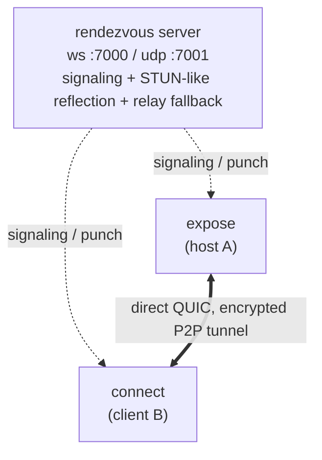

# relay-tunnel

[](https://github.com/chriswirz/relay-tunnel/actions/workflows/ci.yml)

**relay-tunnel** connects two machines directly, peer-to-peer, without manually opening any ports.
A tiny rendezvous server helps the two peers find each other and punch through their NATs.
Once connected, your traffic flows straight between the peers, so the server is not an exit node.

Think of it like `http-tunnel`, except relay-tunnel establishes a real P2P link instead of relaying every byte through the server.
The server only relays data as a last-resort fallback when a direct path is impossible, for example symmetric NAT or CGNAT on both ends.



## Features

- NAT traversal via UDP hole punching, with automatic server-relay fallback when a direct path cannot be established.
- Encrypted and authenticated transport using QUIC (TLS 1.3), with the host's ephemeral certificate fingerprint pinned through the signaling channel so a compromised relay cannot impersonate the host.
- Multiplexed, so one connection carries many concurrent streams.
- TCP port forwarding (`-L`), like SSH local forwards.
- SOCKS5 proxy (`-D`) to reach arbitrary destinations through the peer.
- File transfer (`get` and `put`), with the host's file access confined to a chosen root directory.
- Remote command execution (`exec`), opt-in on the host.
- Automatic reconnection, so a running tunnel resumes on its own after the peer, the network, or the rendezvous server goes offline and comes back.
- An admin web interface on the server, showing the sessions and relay routes it is carrying, backed by an OpenAPI-described API with Swagger UI.
- Single static binary for Linux, macOS, and Windows.

## Install

On Linux, the install script downloads the release binary for your architecture,
verifies it against the published `SHA256SUMS`, and installs it into
`/usr/local/bin` (falling back to `~/.local/bin` if it cannot write there):

```sh
curl -fsSL https://raw.githubusercontent.com/chriswirz/relay-tunnel/main/install.sh | sh
```

Set `RELAY_TUNNEL_VERSION` to pin a release tag, `RELAY_TUNNEL_INSTALL_DIR` to
choose the directory, or `RELAY_TUNNEL_NO_SUDO=1` to never escalate.

With a Go toolchain:

```sh
go install github.com/chriswirz/relay-tunnel/cmd/relay-tunnel@latest
```

Or grab a prebuilt binary from the [Releases](../../releases) page, or build locally:

```sh
make build          # produces ./relay-tunnel
```

### Releases

CI publishes releases automatically once all checks pass.
Every push to the default branch that passes CI updates a rolling release named after the branch, so `/releases/latest` is always the newest build of the current tree.
Pushing a `v*` tag publishes a versioned release with the same artifacts.
Each release carries the binaries for every platform (plus SHA-256 checksums), the `.deb`/`.rpm` packages, and the `relay-sync` example.

### Updating in place

A binary can replace itself from the same releases:

```sh
relay-tunnel --update                     # install the latest release
relay-tunnel --update-version v0.2.0      # install a specific release tag
relay-tunnel update --version v0.2.0      # the same thing as a subcommand
```

The update downloads this platform's asset and the release's `SHA256SUMS`, and installs nothing unless the checksum matches.
The new binary is staged next to the old one and moved into place, so an interrupted update leaves the working binary where it was.

Updating a binary in a system-wide location needs the privileges of that directory (`sudo relay-tunnel --update`); if it was installed from a `.deb` or `.rpm`, prefer updating the package so the package manager's view stays accurate.
Replacing the file does not disturb a running process: restart the server or `expose` host to pick the new version up, and note that a live tunnel keeps running on the old binary until it ends.

On Windows the running image cannot be deleted, so the old binary is moved aside as `relay-tunnel.exe.old` and cleared by the next update.

### Linux packages (.deb / .rpm)

Each release includes `.deb` and `.rpm` packages (amd64 and arm64), built with [nfpm](https://nfpm.goreleaser.com/) from [`packaging/nfpm.yaml`](packaging/nfpm.yaml).

```sh
sudo dpkg -i relay-tunnel_*_amd64.deb     # Debian/Ubuntu
sudo rpm -i  relay-tunnel-*.x86_64.rpm    # Fedora/RHEL/openSUSE
```

The package installs the binary to `/usr/bin/relay-tunnel` and ships a systemd unit for the rendezvous server (not auto-enabled).

```sh
sudo nano /etc/relay-tunnel/server.env          # set ports and --public-udp
sudo systemctl enable --now relay-tunnel-server
```

## Quick start

### 1. Run a rendezvous server (once, somewhere both peers can reach)

```sh
relay-tunnel server --http :7000 --udp :7001
# Behind NAT/load-balancer, advertise the reachable UDP address:
relay-tunnel server --public-udp your.host.example:7001
```

The server needs its TCP (signaling) and UDP (reflection/relay) ports reachable.
It never terminates your tunnel traffic unless relay fallback kicks in.

The TCP port also serves the [admin web interface](#admin-web-interface), at `http://your.host.example:7000/`.

### Why the server has two ports, and whether it must stay up

The server listens on TCP (HTTP) and UDP because they do different jobs.

The TCP port serves the WebSocket signaling channel (`/signal`).
Peers connect to it to pair by session code and to exchange their public addresses and the host's certificate fingerprint.

The UDP port does two things.
It acts as a STUN-like reflector: each peer sends it a probe and learns its own public `ip:port` to share with the other side.
It is also the relay-fallback path: when a direct connection cannot be punched, the peers forward their (still encrypted) QUIC datagrams through this port.

Whether the server must stay up depends on how a session connected.

The server is always required at the start of a session, because pairing and reflection go through it.
Once a **direct** (hole-punched) connection is established, the tunnel is peer-to-peer and no longer touches the server, so the server can go down without dropping that live tunnel.
A **relayed** session, by contrast, carries all its traffic through the server, so the server must stay up for the whole session.

In practice, keep the server running: the `expose` host re-registers with it after each client, and the automatic reconnection described below re-pairs through it whenever a tunnel drops. A server that is only up intermittently means peers can pair only while it happens to be reachable.

### Admin web interface

`relay-tunnel server` serves a web interface on the same port as signaling, at `/`.
It shows what the server is currently carrying: the rendezvous sessions peers are signaling through, and the relay routes forwarding datagrams for pairs that could not punch a direct path.
Both can be closed from the interface, and idle relay routes reclaimed in bulk.

The overview also carries a **UDP reachability** panel, which exists for the one failure this server cannot otherwise explain.
Signaling runs over the HTTP listener and is normally proxied, so it can work perfectly while the UDP reflection port is unreachable; a peer in that situation reports only `reflection timed out` and has no way to tell whether its probes ever arrived.
The panel answers that from the side that knows: it shows the bound address next to the address peers are actually told to probe, counts every datagram read off the socket, and stamps the last one.
A datagram count still at zero while peers are timing out means nothing is reaching the port at all - the port is bound to loopback, or a host firewall or cloud security group is dropping it.
(Recall that UDP must reach the process directly; a reverse proxy in front of the HTTP port has nothing to do with it.)
It also lists peers that signaled but never reflected, because such a peer keeps its role on that code and makes a reconnecting peer fail with `a client is already connected for this code` until the session is deleted.

#### Naming a peer or server

By default the sessions table identifies a peer by its role, relay token and address, which is precise and says nothing about which machine it is.
Any of the three modes can therefore give itself a name:

```sh
relay-tunnel expose  --server wss://SRV/signal --code CODE --name workshop-pi
relay-tunnel connect --server wss://SRV/signal --code CODE --name laptop -L 2222:127.0.0.1:22
relay-tunnel server  --name rendezvous
```

or in the config file, as `name` in the `expose`, `connect` or `server` section - see [Configuration file](#configuration-file).

A peer's name appears next to it in the sessions table, and the server's name titles its overview, which is what tells two rendezvous servers apart in a browser tab.
The name is optional everywhere; leaving it out keeps exactly the behaviour above.

Names are decoration, not identity.
A peer chooses its own name and the server neither verifies it nor uses it for anything: pairing is by session code, and the relay token shown beneath the name is the identifier this server issued.
Anyone holding the code can claim any name, so treat one as a label, not as proof of which machine you are looking at.
What the server does enforce is that a name cannot corrupt what it is displayed in: control characters are stripped, whitespace is collapsed, and the result is capped at 64 bytes.

Setting a name is worth it as soon as more than one device uses a server, and it does not have to be the hostname - `--name "$(hostname)"` if that is what you want, but there is no default, so nothing about the machine is sent unless you ask for it.

Everything it does goes through an API described by [`internal/signal/openapi.json`](internal/signal/openapi.json), which the server publishes at `/openapi.json` and renders as Swagger UI at `/swagger`.
Signed in, you can call every endpoint from that page.

```
GET    /api/v1/status              addresses, uptime, live counts, lifetime totals
GET    /api/v1/sessions            every rendezvous code with a peer on it
GET    /api/v1/sessions/{code}     one rendezvous
DELETE /api/v1/sessions/{code}     close a rendezvous and reclaim its relay routes
GET    /api/v1/relays              every relay route this server is holding
DELETE /api/v1/relays/{token}      drop a relayed pair
DELETE /api/v1/relays?idle_for=15m reclaim every route idle that long
GET    /healthz                    liveness probe
GET    /openapi.json               the API as OpenAPI 3.1
```

Deleting things reaches only what still passes through this server.
Closing a session ends a rendezvous, and dropping a relay cuts a pair that never got a direct path; a tunnel that already punched through is unaffected, because its traffic does not come here.

#### Signing in

There is exactly one administrator account, and the interface is the only way in: every endpoint above needs a signed-in browser holding the session cookie.
A server with no password set accepts `admin`/`admin` **once** and then shows nothing until a new password is chosen.
The chosen password is hashed with PBKDF2-HMAC-SHA256 and written to the config file, so it survives a restart; renaming the account retires the old name rather than leaving a second way in.

Because the account change is written to the config file, start the server with the `--config` path you want it saved to (the default is `config.json` in the working directory).

#### Turning it off

```sh
relay-tunnel server --admin=false     # signaling alone, no interface and no API
```

The same thing in the config file is `"admin": {"disabled": true}` inside the `server` section.
Behind a reverse proxy, see [deploying behind nginx](#deploying-behind-a-reverse-proxy-nginx) for restricting the interface to a trusted range and for the one setting it needs to know it is behind TLS.

### 2. On the machine you want to reach (`expose`)

```sh
relay-tunnel expose --server ws://your.host.example:7000/signal --allow-dial
```

This prints a session code.
Share it with the other side out-of-band.

### 3. On your machine (`connect`)

```sh
# Forward local :9000 to the host's 127.0.0.1:8080
relay-tunnel connect --server ws://your.host.example:7000/signal --code CODE \
  -L 9000:127.0.0.1:8080
```

Now `http://localhost:9000` on your machine hits `127.0.0.1:8080` on the host, directly and peer-to-peer.

## Usage

```
relay-tunnel server   [--http :7000] [--udp :7001] [--public-udp HOST:7001] [--public-url URL]
relay-tunnel expose   --server ws://HOST:7000/signal [--code CODE] [policy]
relay-tunnel connect  --server ws://HOST:7000/signal --code CODE [actions]
relay-tunnel version
```

`--public-url` is optional and informational: the server logs it at startup as the URL clients should use. It matters behind a reverse proxy, where the internal `--http` address is not the address clients dial.

### Session code (`--code`)

The session code is the shared secret that pairs the two peers on the rendezvous server.
Both sides must present the same code, and the server only pairs a `host` (`expose`) with a `client` (`connect`) that carry an identical code.
On `expose`, `--code CODE` sets the code explicitly, and if you omit it a random code is generated and printed for you to share.
On `connect`, `--code CODE` is required and must match the code from the `expose` side.
Share the code over a trusted channel and treat it as a secret, because anyone who has it (and can reach the server) can pair with your host, subject to the host's policy flags.

### `expose` policy flags

The host is deny-by-default.
Grant exactly what you need.

| Flag                | Effect                                                        |
|---------------------|--------------------------------------------------------------|
| `--allow-dial`      | Let the client open TCP connections through this host (`-L`, `-D`). |
| `--allow host:port` | Whitelist a single dial target (repeatable). Implies dialing. |
| `--name NAME`       | Label this peer in the server's admin interface.             |
| `--allow-exec`      | Allow remote command execution (`exec`).                     |
| `--file-root DIR`   | Allow file `get`/`put`, confined to `DIR`.                   |

### `connect` actions

| Action                              | Description                              |
|-------------------------------------|------------------------------------------|
| `-L [laddr:]lport:rhost:rport`      | Local port forward (repeatable).         |
| `-D [laddr:]lport`                  | Local SOCKS5 proxy through the peer.      |
| `get REMOTE LOCAL`                  | Download a file from the host.           |
| `put LOCAL REMOTE`                  | Upload a file to the host.               |
| `exec -- CMD [ARGS...]`             | Run a command on the host.               |
| `--name NAME`                       | Label this peer in the server's admin interface. |

#### Local port forward (`-L`) vs SOCKS5 proxy (`-D`)

A local port forward has a single fixed destination that you choose when you start it.
With `-L 9000:127.0.0.1:8080`, every connection to local port 9000 is sent to `127.0.0.1:8080` as seen from the host, and nothing else.
Use `-L` when you want to reach one specific service through the peer.

A SOCKS5 proxy has no fixed destination; the destination is chosen per-connection by the client application.
With `-D 1080`, any SOCKS5-aware program (a browser, `curl --socks5`, and so on) can ask the proxy for any host and port, and the host dials it on demand.
Use `-D` when you want general, on-demand access to many destinations reachable from the peer, similar to a lightweight VPN for TCP.

In short, `-L` is one preset tunnel to one address, while `-D` is a dynamic proxy that opens a new tunnel to whatever address each request names.
Both require the host to permit dialing (`--allow-dial`, or an `--allow` entry that matches the target).

#### Which port lives on which machine

A forward spec is read left to right, and the split is not where people expect it: **the first field is local, everything after it is remote.**

```
-L 2222:127.0.0.1:22
   ^^^^ ^^^^^^^^^^^^
   |    |
   |    `-- remote: dialed BY THE HOST, in the host's own network
   `------- local:  listened on by the CLIENT, on your machine
```

So `-L 2222:127.0.0.1:22` means: listen on port 2222 on the machine running `connect`, and send every connection to it out of the machine running `expose`, which dials `127.0.0.1:22` as itself.
`127.0.0.1` there is the *host's* loopback, not yours - that is what lets you reach a service bound to loopback on a remote machine that accepts nothing from the network.

To SSH into the host from the client:

```sh
# on the host (the machine you want to reach)
relay-tunnel expose --server wss://SRV/signal --code CODE --allow 127.0.0.1:22

# on the client (the machine you are sitting at)
relay-tunnel connect --server wss://SRV/signal --code CODE -L 2222:127.0.0.1:22
ssh -p 2222 user@127.0.0.1
```

`ssh` connects to 2222 on your own machine; the tunnel carries it to the host, which opens `127.0.0.1:22` on itself.
The local port is yours to choose - 2222 rather than 22 because binding a port below 1024 needs root, and because 22 is probably already taken by your own `sshd`.
The remote port must match whatever the service actually listens on there.

Two things to watch:

- **Do not swap the ends.** `-L 22:127.0.0.1:2222` listens on *your* port 22 and dials port 2222 on the host, which is almost never what is wanted and needs root to bind besides.
- **The remote host need not be loopback.** `-L 5432:db.internal:5432` has the host dial `db.internal` across its own network, so anything the host can reach, you can reach.

#### Config example: reaching device A's SSH from device B

The same spec goes in `connect.forward` verbatim, minus the `-L`.
Here is the whole thing as config files, for the case where **device A** runs `sshd` on port 22 and you want to reach it from **device B** as `127.0.0.1:122`.

**Device A** - the machine being reached. It runs `expose`, and permits exactly one dial target, its own SSH port:

```json
{
  "expose": {
    "enabled": true,
    "server": "wss://rt.example.com/signal",
    "code": "a-to-b",
    "allow": ["127.0.0.1:22"],
    "allow_dial": false,
    "allow_exec": false,
    "verbose": false
  }
}
```

**Device B** - the machine you are sitting at. It runs `connect`, and opens local port 122:

```json
{
  "connect": {
    "enabled": true,
    "server": "wss://rt.example.com/signal",
    "code": "a-to-b",
    "forward": ["122:127.0.0.1:22"],
    "verbose": false
  }
}
```

Start `relay-tunnel` on both (with no subcommand it runs whichever sections are `enabled`), then on device B:

```sh
ssh -p 122 user@127.0.0.1
```

Reading `"122:127.0.0.1:22"` in that light: **122** is opened on device B, and **127.0.0.1:22** is dialed by device A on itself.
The two ports are independent - 122 is simply a free port on B, chosen so it does not collide with B's own `sshd` on 22, and it could equally be 2222 or 8022.
Only the right-hand `22` has to match what device A actually listens on.

The `allow` entry on device A is what makes the forward work at all.
A host with neither `allow_dial` nor a matching `allow` refuses to open the connection, and the symptom is a forward that accepts on port 122 and then goes nowhere.
A non-empty `allow` list implies dialing on its own, so `"allow_dial": false` alongside it is not a contradiction: it says *dial only what is listed*, which keeps device A reachable for SSH and nothing else.
Setting `"allow_dial": true` with an empty list is the opposite - it lets the client dial anything device A can reach.

One caveat about 122 specifically: it is below 1024, and on Linux and macOS binding a privileged port needs root.
Either run device B's `relay-tunnel` with `sudo`, or pick a port above 1024 - `"forward": ["2222:127.0.0.1:22"]` with `ssh -p 2222 user@127.0.0.1`, which is the same tunnel without the privilege.

### Examples

```sh
# SOCKS5 proxy: browse the host's network from your machine
relay-tunnel connect --server ws://SRV:7000/signal --code CODE -D 1080

# Multiple forwards at once
relay-tunnel connect --server ws://SRV:7000/signal --code CODE \
  -L 8000:127.0.0.1:80 -L 5432:db.internal:5432

# File transfer (host started with --file-root /srv/share)
relay-tunnel connect --server ws://SRV:7000/signal --code CODE get report.pdf ./report.pdf
relay-tunnel connect --server ws://SRV:7000/signal --code CODE put ./patch.tar.gz incoming/patch.tar.gz

# Remote command (host started with --allow-exec)
relay-tunnel connect --server ws://SRV:7000/signal --code CODE exec -- uname -a
```

## Configuration file

Every subcommand can read its settings from a JSON config file, which is handy for keeping the session code and server URL nearby across re-runs.
Command-line flags always take priority, so a value in the file is used only when the matching flag is not given.
By default the tool looks for `config.json` in the current directory, and `--config PATH` points it at another file.
A missing default `config.json` is ignored, but a file named explicitly with `--config` must exist.

Print a fully populated sample to stdout and save it as a starting point.

```sh
relay-tunnel --example-config > config.json
```

The file has one section per subcommand: `server`, `expose`, and `connect`.
Each section mirrors that subcommand's flags, and each subcommand reads only its own section.
Empty or omitted fields never override a flag or a built-in default.

```json
{
  "server": {
    "enabled": false,
    "name": "rendezvous",
    "http": ":7000",
    "udp": ":7001",
    "public_udp": "your.host.example:7001",
    "public_url": "wss://your.host.example/signal",
    "verbose": false,
    "admin": {
      "disabled": false,
      "username": "admin",
      "password_hash": "",
      "session_hours": 12,
      "trust_forwarded_headers": false
    }
  },
  "expose": {
    "enabled": false,
    "name": "workshop-pi",
    "server": "ws://your.host.example:7000/signal",
    "code": "your-session-code",
    "allow_dial": true,
    "allow": ["127.0.0.1:8080"],
    "allow_exec": false,
    "file_root": "/srv/share",
    "verbose": false
  },
  "connect": {
    "enabled": false,
    "name": "laptop",
    "server": "ws://your.host.example:7000/signal",
    "code": "your-session-code",
    "forward": ["9000:127.0.0.1:8080"],
    "socks": ["1080"],
    "verbose": false
  }
}
```

The `server` field inside `expose` and `connect` is the signaling server URL those sides dial.
The top-level `server` section, by contrast, configures the rendezvous server subcommand itself.

`name` is optional in all three sections and exists only to make the [admin interface](#admin-web-interface) readable: a peer's name labels it in the sessions table, and the server's name titles its own overview.
See [Naming a peer or server](#naming-a-peer-or-server).

The `admin` block inside it configures the [web interface](#admin-web-interface).
`password_hash` is written by the server itself when an administrator sets a password, and is the one field not meant to be edited by hand.
`session_hours` is how long a signed-in browser stays signed in, and `trust_forwarded_headers` tells the server to believe `X-Forwarded-Proto` and `X-Forwarded-For`, which is correct behind a reverse proxy you control and wrong on a server reachable directly.

### Running from config with `enabled`

Each section has an `enabled` flag.
When you run the binary with no subcommand, every section whose `enabled` is `true` is started, and the running mode uses that section's settings.

```sh
relay-tunnel                 # run every enabled section in config.json
relay-tunnel --config other.json
```

If more than one section is enabled, they run concurrently in the same process, which is useful for running the rendezvous server and an `expose` host together on one machine.
When you run an explicit subcommand, `enabled` is ignored and only that subcommand runs.
If no subcommand is given and no section is enabled, the tool prints an error and the usage help.

With that file present, the earlier three-terminal example becomes shorter.

```sh
relay-tunnel server                 # reads http/udp from config.json
relay-tunnel expose                 # reads server/code/policy from config.json
relay-tunnel connect                # reads server/code/forward from config.json
```

The config file may contain your session code, so treat it as a secret and keep it out of version control.

## Deploying behind a reverse proxy (nginx)

You can put the rendezvous server behind nginx to terminate TLS, serving signaling over `wss://` and the admin interface over `https://`.
nginx reverse-proxies the server's HTTP port, which carries both; the UDP port is exposed to the server directly.
A ready-to-edit config is in [`deploy/nginx/relay-tunnel.conf`](deploy/nginx/relay-tunnel.conf).

Run the server listening on loopback for HTTP, exposing UDP directly, and advertising both public addresses:

```sh
relay-tunnel server \
  --http 127.0.0.1:7000 \
  --udp 0.0.0.0:7001 \
  --public-udp relay.example.com:7001 \
  --public-url wss://relay.example.com/signal
```

Clients then use `--server wss://relay.example.com/signal`.

The nginx site proxies `/signal` with the WebSocket upgrade headers:

```nginx
map $http_upgrade $connection_upgrade { default upgrade; '' close; }

server {
    listen 443 ssl;
    server_name relay.example.com;
    ssl_certificate     /etc/letsencrypt/live/relay.example.com/fullchain.pem;
    ssl_certificate_key /etc/letsencrypt/live/relay.example.com/privkey.pem;

    location /signal {
        proxy_pass http://127.0.0.1:7000;
        proxy_http_version 1.1;
        proxy_set_header Upgrade $http_upgrade;
        proxy_set_header Connection $connection_upgrade;
        proxy_set_header Host $host;
        proxy_read_timeout 1h;
        proxy_send_timeout 1h;
    }

    # The admin interface and its API.
    location / {
        proxy_pass http://127.0.0.1:7000;
        proxy_set_header Host $host;
        proxy_set_header X-Forwarded-For $remote_addr;
        proxy_set_header X-Forwarded-Proto $scheme;

        # Uncomment to keep the interface off the public internet.
        # allow 203.0.113.0/24;
        # deny  all;
    }
}
```

Three things are important.

The UDP reflection/relay port must reach the server directly, not through nginx.
The server has to observe each peer's real public address for hole punching, so if UDP were proxied it would see nginx's address instead and punching would fail.
Open UDP 7001 straight to the server and advertise it with `--public-udp`.

Set `"trust_forwarded_headers": true` in the server's `admin` config when proxying like this.
The server listens on plain HTTP while browsers reach it over TLS, and that setting is what lets it believe the `X-Forwarded-Proto` above, so the admin session cookie is marked `Secure`.
Set it only behind a proxy you control: on a directly reachable server, anyone can send that header.

There is deliberately no `public_http` setting to match `public_udp`.
`public_udp` exists because the server has to tell each peer a reachable UDP address to send probes to.
The HTTP signaling endpoint is different: it is simply the URL clients already dial, so the server never needs to advertise it to peers.
The optional `--public-url` is only cosmetic, logged at startup so operators copy the right `wss://` URL.

### Can the server run through http-tunnel instead of nginx?

Not usefully, no.
A general HTTP tunnel such as [https-tunnel](https://github.com/chriswirz/https-tunnel) publishes a local HTTP port on a public URL by replaying HTTP requests, but it carries neither WebSockets (it strips the `Upgrade` header) nor UDP.
relay-tunnel needs both a long-lived WebSocket for signaling and a publicly reachable UDP port for reflection and relay, so an HTTP-only tunnel cannot host the rendezvous server.
And since a publicly reachable UDP endpoint is required regardless, you already need a reachable server, so a proxy such as nginx is the right tool for the TLS front end.

## How it works

1. Rendezvous.
   Both peers connect to the server over WebSocket with the same session code, and the server pairs them.
2. Reflection.
   Each peer sends a UDP probe to the server, which echoes back the peer's observed public `ip:port` (STUN-like).
3. Exchange.
   The server relays each peer's public address to the other, plus the addresses each peer reports for its own networks, plus the host's TLS certificate fingerprint to the client.
4. Hole punch.
   Both peers simultaneously send UDP packets to every address the other offered, opening their NAT mappings, and take the first that answers.
5. QUIC.
   If punching succeeds, the peers run QUIC directly over the punched socket, and the client pins the host's certificate fingerprint.
6. Fallback.
   If punching fails, both peers tunnel their (still QUIC-encrypted) datagrams through the server, which forwards opaque packets between them.
   Set `RT_FORCE_RELAY=1` to force this path.

### Why more than one address per peer

The reflected public address is the only one the server can observe, and it is the wrong one whenever both peers sit behind the same NAT - a laptop and a device on the same home or office LAN, say.
Reaching it means asking the router to send a packet back into the network it came from (NAT hairpinning), which many routers refuse, so punching fails and both peers fall back to relaying through the server - two machines on one switch sending their traffic out to the internet and back.

Each peer therefore also reports the addresses it can be reached at on its own networks, which the server passes through untouched.
`Punch` probes the reflected address and the local ones together and keeps whichever answers first, so a same-NAT pair connects over the LAN in milliseconds while the internet case is unchanged.
The log names the winner:

```
peer candidates: 203.0.113.7:61003, 192.168.0.179:61003 (starting hole punch)
direct P2P connection established with 192.168.0.179:61003
```

Local addresses are advisory: the server never verifies them, and a peer that offers unreachable ones simply has those candidates time out alongside the others.
Loopback and IPv6 link-local addresses are left out, since neither can describe this machine to another one.
The admin interface shows each peer's candidates alongside its reflected address, and two peers sharing a public address is the signature of a pair that needs this.

A separate case this does not solve is a **symmetric NAT**, which assigns a different external port per destination: the port the server reflects is the mapping for traffic to the server, so probes to the peer arrive from a port the peer is not expecting. Relay fallback covers it.

## Resilience and reconnection

A running `connect` tunnel survives outages and resumes on its own.
The `expose` host already stays up and re-registers with the rendezvous server after each client disconnects, so it keeps waiting for the next connection.
On the `connect` side, the local `-L` and `-D` listeners stay open the whole time, and a connection manager re-establishes the underlying tunnel with exponential backoff whenever it drops.

So if the host restarts, the network drops, or the rendezvous server is briefly down, the client keeps its ports open and reconnects automatically once the peer is reachable again, then new connections flow through as before.
QUIC keep-alives hold a healthy link open, while a short idle timeout lets the client notice a peer that has genuinely gone away and reconnect promptly.
A host that shuts down cleanly closes its connection so the client reconnects immediately rather than waiting out the idle timeout.
Connections that were in flight at the moment of the outage are dropped; new ones opened after the tunnel returns work normally.

## Security model

- All tunnel traffic is QUIC/TLS 1.3 encrypted end-to-end, including over the relay fallback, where the server sees only opaque ciphertext.
- The host authenticates via an ephemeral certificate whose fingerprint is pinned by the client through the signaling channel, and the session code gates who may pair.
- The host is deny-by-default: dialing, exec, and file access are each opt-in, and file access is path-confined to `--file-root`.
- Treat the session code as a secret and share it over a trusted channel.
- Run the signaling server over TLS (`wss://`, for example behind a reverse proxy) in production.

Note: `--allow-exec` grants remote code execution to whoever holds the session code.
Enable it only when you trust the other party.

## Development

```sh
make build      # build ./relay-tunnel
make web        # export the admin web interface into internal/webui/out
make examples   # build everything under examples/ for this machine
make test       # go test -race ./...
make vet        # go vet ./...
make fmt        # gofmt -w .
make lint       # golangci-lint run
```

You can also build with the helper scripts.

```sh
./build.sh              # host build into ./relay-tunnel
./build.sh --web        # export the admin web interface into internal/webui/out
./build.sh --examples   # build everything under examples/ for this machine
./build.sh --all        # build the web interface, then cross-compile the CLI and the examples into ./dist
./build.sh --test       # gofmt, go vet, and go test
```

```powershell
.\build.ps1             # host build into relay-tunnel.exe
.\build.ps1 -Web        # export the admin web interface into internal\webui\out
.\build.ps1 -Examples   # build everything under examples\ for this machine
.\build.ps1 -All        # build the web interface, then cross-compile the CLI and the examples into dist\
.\build.ps1 -Test       # gofmt, go vet, and go test
```

On Windows, `build.cmd` is a thin wrapper that runs `build.ps1` and accepts the same `--web`, `--examples`, `--all` and `--test` arguments.

`--all` lays out `dist/` the way a release does: the CLI for every target at the top level, the examples under `dist/examples/`, and one `SHA256SUMS` covering both.

### Web interface

The interface in [`web/`](web) is a Next.js application, statically exported and embedded in the binary with `go:embed`, so a server needs nothing on disk but the binary.

```sh
cd web && npm install
npm run build     # export into ../internal/webui/out, where the Go build embeds it
npm run dev       # develop against a server running separately on :7000
npm run codegen   # regenerate a typed client from internal/signal/openapi.json
```

The export is a build artifact and is not committed.
`go build` with no `npm run build` before it produces a working binary that serves the API alone and says so, which is why the Go tests do not need node.
[`internal/signal/openapi.json`](internal/signal/openapi.json) is the single source of truth for the API: the server publishes it, the Swagger page renders it, and `npm run codegen` generates the TypeScript client from it.

### Integration tests

A multi-process suite in [`test/integration`](test/integration) launches a real server, `expose`, and `connect` as separate processes and drives traffic through the tunnel.
It covers the direct path, relay fallback, `-L`, SOCKS, file transfer, and exec.
It is build-tagged so it does not run in the default unit-test pass.

```sh
go test -tags integration ./test/integration/...
```

CI runs it on Linux, macOS, and Windows.

### Examples

Every program under `examples/` is cross-compiled and attached to each release alongside the CLI, so it can be run without a Go toolchain.

[`examples/relay-sync`](examples/relay-sync) is a small application built on this module.
It performs one-way directory synchronization (a mirror) between two machines over a direct peer-to-peer connection, reusing the module's rendezvous and QUIC transport and adding its own sync protocol.
See its [README](examples/relay-sync/README.md) for usage.

### Layout

```
cmd/relay-tunnel      CLI entrypoint and subcommands
examples/relay-sync   example app: one-way directory sync over the module
internal/signal       rendezvous protocol, server, admin API, and client
internal/webui        the embedded web interface (built from web/)
web                   Next.js source for that interface
internal/nat          UDP reflection, hole punching, relay packet-conn
internal/transport    QUIC transport, cert generation and pinning
internal/mux          per-stream framing (tcp / file / exec)
internal/app          host serving plus client forwards/SOCKS/file/exec
internal/xlog         tiny leveled logger
```

## Roadmap

- WebRTC/ICE transport as an additional traversal path.
- Config file and persistent session identities.

## License

[MIT](LICENSE)
